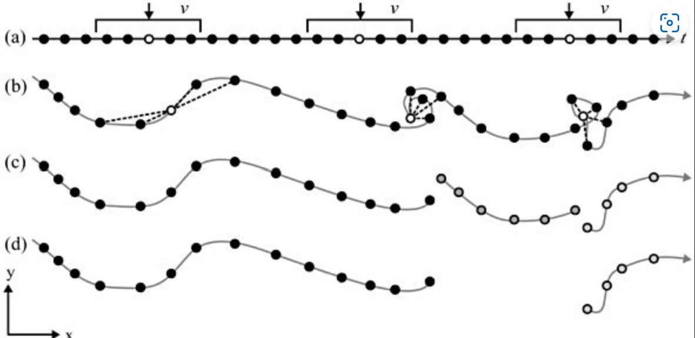

```{r setup, include=FALSE}
knitr::opts_chunk$set(echo = TRUE)

library(readr) # to import tabular data (e.g. csv)
library(dplyr) # to manipulate (tabular) data
library(ggplot2) # to visualize data
library(sf) # to handle spatial vector data
library(terra) # To handle raster data
library(lubridate) # To handle dates and times
library(SimilarityMeasures)
library(RColorBrewer)

mycolors4 <- brewer.pal(4, "BrBG")
```

You've read Laube and Purves (2011) about segmenting trajectories. In the paper, the authors define "static" fixes as "those whose average Euclidean distance to other fixes inside a temporal window v is less than some threshold d", as illustrated in the following figure:



a.  Specify a temporal windows v for in which to measure Euclidean distances

b.  Measure the distance from every point to every other point within this temporal window (v)

c.  Remove "static points": These are points where the average distance is less than a given threshold. This segments the trajectory into subtrajectories

d.  Now remove short subtrajectories: These are trajectories with a short duration (whereas "short" is tbd)

We will **demonstrate** implementing this method on the wild boar "Sabi", restricting ourselves to a couple of tracking days. Your task will be to understand this implementation and apply it on Caro, with a different sampling interval.

#### **Step a): Specify a temporal window** *v*

In the above dataset, the sampling interval is 15 minutes. If we take a temporal window of 60 minutes, that would mean including 4 fixes. We need to calculate the following Euclidean distances (pos representing single location):

1.  `pos[n-2]` to `pos[n]`

2.  `pos[n-1]` to `pos[n]`

3.  `pos[n]` to `pos[n+1]`

4.  `pos[n]` to `pos[n+2]`

```{r}
caro <- read_csv("data/caro60.csv")
```

#### **Step b): Measure the distance from every point to every other point within this temporal window** *v*

Just like last week, we use the formula for calculating the Euclidean distance in in combination with `lead()` and `lag()`. For example, to create the necessary offset of n-2, we use `lag(x, 2)`. For each offset, we create one individual column.

```{r}
caro <- caro |>
    mutate(
        nMinus2 = sqrt((lag(E, 2) - E)^2 + (lag(N, 2) - N)^2), # distance to pos -30 minutes
        nMinus1 = sqrt((lag(E, 1) - E)^2 + (lag(N, 1) - N)^2), # distance to pos -15 minutes
        nPlus1  = sqrt((E - lead(E, 1))^2 + (N - lead(N, 1))^2), # distance to pos +15 mintues
        nPlus2  = sqrt((E - lead(E, 2))^2 + (N - lead(N, 2))^2) # distance to pos +30 minutes
    )
```

Now we want to calculate the mean distance of `nMinus2`, `nMinus1`, `nPlus1`, `nPlus2` for each row. Since we want the mean value *per Row*, we have to explicitly specify this before `mutate()` with the function `rowwise()`. To remove this rowwise-grouping, we end the operation with `ungroup()`.

Note that for the first two positions, we cannot calculate a `stepMean` since there is no Position `n-2` for these positions. This is also true for the last to positions (lacking a position `n+2`).

```{r}
caro <- caro |>
    rowwise() |>
    mutate(
        stepMean = mean(c(nMinus2, nMinus1, nPlus1, nPlus2))
    ) |>
    ungroup()

caro
```

#### **Step c): Remove "static points"**

We can now determine if an animal is moving or not by specifying a threshold distance on `stepMean`. In our example, we use the mean value as a threshold: Positions with distances below this value are considered static.

```{r}
caro <- caro |>
    ungroup() |>
    mutate(static = stepMean < mean(stepMean, na.rm = TRUE))

caro_filter <- caro |>
    filter(!static)

caro_filter |>
    ggplot(aes(E, N)) +
    geom_path() +
    geom_point() +
    coord_fixed() +
    theme(legend.position = "bottom")
```

### **Preperation**

With the skills from the input above you can now implement the segmentation algorithm described in Laube and Purves ([2011](https://computationalmovementanalysis.github.io/FS23/90_references.html#ref-laube2011)) to your own movement data. Grab your data from last week (or get the most current data from your posmo interface or tracker device) and import it as `data.frame`. Add this data to the .gitignore file to prevent it from being uploaded to GitHub.

```{r}
library("readr")
library("sf")

posmo <- read_delim("private/posmo.csv")

# Keep only the necessary columns
posmo <- select(posmo, datetime, lon_x, lat_y)
```

As before, we will calculate the euclidean distance "by hand". This means we need the coordinates of our locations stored in a **Projected CRS**. Our data is stored in a geodetic coordinate reference system (WGS84, i.e. EPSG 4326). We can transform the data to EPSG 2056 with the function `st_transform`, as we explained in [the first week](https://computationalmovementanalysis.github.io/FS23/Week1/W1_5_tasks_and_inputs.html#sec-week1-task3-reproject).

```{r}
posmo <- st_as_sf(posmo, coords = c("lon_x","lat_y"), crs = 4326) |>
  st_transform(2056)

head(posmo)
```

To be able to compute euclidean distances by hand, we need the coordinates stored in separate columns. The function `st_coordinates` extracts the coordinates from our `sf` object. We can bind these coordinates back to our `sf` object using `cbind`

```{r}
posmo_coordinates <- st_coordinates(posmo)

posmo <- cbind(posmo, posmo_coordinates)
```

Explore your data and choose a single day for the next steps.

```{r}
posmo_filter <- posmo |>
    filter(as.Date(datetime) == "2023-05-07")
```

Once you have completed the task, commit your changes with a meaningful commit message. Before committing, make sure your location data is ignored. Then, test your connection to Github by pushing your changes to your remote repository.

### **Task 1: Segmentation**

If you haven't already done so open the RStudio Project [you have prepared](https://computationalmovementanalysis.github.io/FS23/Week3/W3_3_preparation.html) for this week.

With the skills from the input above you can now implement the segmentation algorithm described in Laube and Purves ([2011](https://computationalmovementanalysis.github.io/FS23/90_references.html#ref-laube2011)) on your own data.

The sampling interval for this dataset is 1 minute. Use a temporal window v of 6 minutes, i.e. a window size of 6 positions (`n±3`).

Once you have completed the task, commit your changes with a meaningful commit message and test your connection to Github by pushing your changes to your remote repository.

```{r}
posmo_filter <- posmo_filter |>
    mutate(
      nMinus3 = sqrt((lag(X, 3) - X)^2 + (lag(Y, 3) - Y)^2), # distance to pos -3 minutes
        nMinus2 = sqrt((lag(X, 2) - X)^2 + (lag(Y, 2) - Y)^2), # distance to pos -2 minutes
        nMinus1 = sqrt((lag(X, 1) - X)^2 + (lag(Y, 1) - Y)^2), # distance to pos -1 minutes
        nPlus1  = sqrt((X - lead(X, 1))^2 + (Y - lead(Y, 1))^2), # distance to pos +1 mintues
        nPlus2  = sqrt((X - lead(X, 2))^2 + (Y - lead(Y, 2))^2), # distance to pos +2 minutes
      nPlus3 = sqrt((X - lead(X, 3))^2 + (Y - lead(Y, 3))^2), # distance to pos +2 minutes
    )
```

```{r}
posmo_filter <- posmo_filter |>
    rowwise() |>
    mutate(
        stepMean = mean(c(nMinus3, nMinus2, nMinus1, nPlus1, nPlus2, nPlus3))
    ) |>
    ungroup()

posmo_filter
```

### **Task 2: Specify and apply threshold *d***

After calculating the Euclidean distances to positions within the temporal window *v* in task 1, you can explore these values (we stored them in the column `stepMean`) using summary statistics (histograms, boxplot, `summary()`): This way we can define a reasonable threshold value to differentiate between *stops* and *moves*. There is no "correct" way of doing this, specifying a threshold always depends on data as well as the question that needs to be answered. In this exercise, use the mean of all `stepMean` values.

Store the new information (boolean to differentiate between stops (`TRUE`) and moves (`FALSE`)) in a new column named `static`.

Commit your changes with a meaningful commit message.

```{r}
ggplot(posmo_filter, aes(stepMean)) +
  geom_histogram() +
  geom_vline(xintercept = mean(posmo_filter$stepMean, na.rm=TRUE))

summary(posmo_filter$stepMean)

ggplot(posmo_filter, aes(stepMean)) +
  geom_boxplot()
```

```{r}
posmo_filter <- posmo_filter |>
    ungroup() |>
    mutate(static = stepMean < mean(stepMean, na.rm = TRUE))

posmo_filter2 <- posmo_filter |>
    filter(!static)
```

### **Task 3: Visualize segmented trajectories**

Now visualize the segmented trajectory spatially. Just like last week, you can use ggplot with `geom_path()`, `geom_point()` and `coord_equal()`. Assign `colour = static` within `aes()` to distinguish between segments *with* "movement" and *without*.

Commit your changes with a meaningful commit message.

```{r}
ggplot(caro, aes(E, N, color = static)) +
  geom_path() +
  geom_point() +
  coord_equal() +
  theme_linedraw()
```

### **Task 4: Segment-based analysis**

In applying Laube and Purves ([2011](https://computationalmovementanalysis.github.io/FS23/90_references.html#ref-laube2011)), we've come as far as steps b in the figure above. In order to complete the last steps (c and d), we need a *unique* ID for each segment that we can use as a grouping variable. The following function does just that (it assigns unique IDs based on the column `static` which you created in Task 2). You will learn about functions next week. For now, just copy the following code chunk into your script and run it.

```{r}
rle_id <- function(vec) {
    x <- rle(vec)$lengths
    as.factor(rep(seq_along(x), times = x))
}
```

You can use the newly created function `rle_id` to assign unique IDs to subtrajectories (as shown below). Visualize the *moving* segments by colourizing them by `segment_ID`. Then use `segment_ID` as a grouping variable to determine the segments duration and remove short segments (e.g. segments with a duration \< 5 Minutes)

Commit your changes with a meaningful commit message.

```{r}
caro <- caro |>
    mutate(segment_id = rle_id(static))

caro
```

### **Task 5: Similarity measures**

We will now leave the wild boar data and turn our attentian to human movement. You will use the dataset [pedestrian.csv](https://moodle.zhaw.ch/pluginfile.php/1168373/mod_folder/content/0/pedestrian.csv?forcedownload=1) for this (and the following) task. Download an import this dataset as a `data.frame` or `tibble`. It it a set of six different but similar trajectories from pedestrians walking on a path.

For this task, explore the trajectories first and get an idea on how the pedestrians moved. We step away from using the wild boar data for this task because our animals don't express the type of similarity we want to illustrate here. Also, using the constructed pedestrian data allows us illustrating very typical similarity issues, that are picked-up in different ways by the different similarity measures. In later exercises we will get back to our wild boar!

Commit your changes with a meaningful commit message.

```{r}
pedestrian <- read_csv("data/pedestrian.csv")
```

```{r}
ggplot(pedestrian, aes(E, N, color = TrajID)) +
  geom_path() +
  geom_point() +
  coord_equal() +
  facet_grid(cols=vars(pedestrian$TrajID)) +
  theme_linedraw()
```

**Task 6: Calculate similarity**

Install the package `SimilarityMeasures` (`install.packages("SimilarityMeasures")`). Familiarize yourself with this package by skimming through the function descriptions `help(package = "SimilarityMeasures")`. Now compare trajectory 1 to trajectories 2-6 using different similarity measures from the package. Your options are. `DTW`, `EditDist`, `Frechet` and `LCSS`.

Visualize your results and try to understand the different results with respect to your reading of Alan Both ([2018](https://computationalmovementanalysis.github.io/FS23/90_references.html#ref-both2018)). Can you see connections between the properties of the trajectories and the similarity values computed by the different measures?

Note:

-   All functions in the package need matrices as input, with one trajectory per matrix.

```{r}
pedestrian1 <- pedestrian |> 
  filter(TrajID == 1) |> 
  select(E, N)

pedestrian2 <- pedestrian |> 
  filter(TrajID == 2) |> 
  select(E, N)

pedestrian3 <- pedestrian |> 
  filter(TrajID == 3)

pedestrian4 <- pedestrian |> 
  filter(TrajID == 4)

pedestrian5 <- pedestrian |> 
  filter(TrajID == 5)

pedestrian6 <- pedestrian |> 
  filter(TrajID == 6)
```

-   `LCSS`takes very long to compute. The accuracy of the algorithm (`pointSpacing =` ,`pointDistance =` and `errorMarg =`) can be varied to provide faster calculations. Please see Vlachos, Gunopoulos, and Kollios ([2002](https://computationalmovementanalysis.github.io/FS23/90_references.html#ref-vlachos2002)) for more information.

```{r}
#install.packages("SimilarityMeasures")

#Frechet

pedestrian1 <- data.matrix(pedestrian1)
pedestrian2 <- data.matrix(pedestrian2)

str(pedestrian1)
is.matrix(pedestrian1)

frechet <- Frechet(pedestrian1, pedestrian2, testLeash = 1)
editDist <- EditDist(pedestrian1, pedestrian2, pointDistance=20)
```

Commit your changes with a meaningful commit message. Now push all your changes to Github.

```{r}

```
